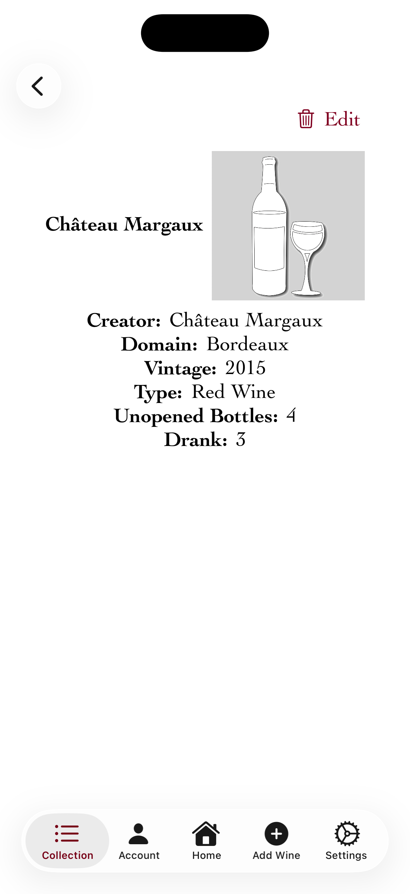

# iOS Wine Collection Tracking Application

## Features
* Designed UI using SwiftUI
* Provided on-device persistence with CoreData
* Leveraged caching to speed up large queries
* Used OOP principles to represent accounts and wines with an aggregate relationship
* Wrote a quicksort implementation to sort and filter wines based on object attributes
* Created account authentication page

## Application Screenshots

## Authentication Pages

  
  &nbsp;&nbsp;&nbsp;&nbsp;&nbsp;&nbsp;&nbsp;&nbsp;&nbsp;&nbsp;&nbsp;&nbsp;&nbsp;
  

#### Signup

* Create account which persists on-device
* Checks for valid fields (including email in format `XXXXX@XXX.XXX`)
* Compares with stored accounts to verify unique username

#### Login
* Checks entered username and password, displaying message to user in case of invalid credentials
* Passes authenticated password to app state for use in main pages

## Main Pages

  
  
  
  

    
      &nbsp;&nbsp;&nbsp;&nbsp;&nbsp;&nbsp;&nbsp;&nbsp;&nbsp;&nbsp;&nbsp;&nbsp;&nbsp;&nbsp;
      
      &nbsp;&nbsp;&nbsp;&nbsp;&nbsp;&nbsp;&nbsp;&nbsp;&nbsp;&nbsp;&nbsp;&nbsp;&nbsp;&nbsp;
      
      &nbsp;&nbsp;&nbsp;&nbsp;&nbsp;&nbsp;&nbsp;&nbsp;&nbsp;&nbsp;&nbsp;&nbsp;&nbsp;&nbsp;
      
  

