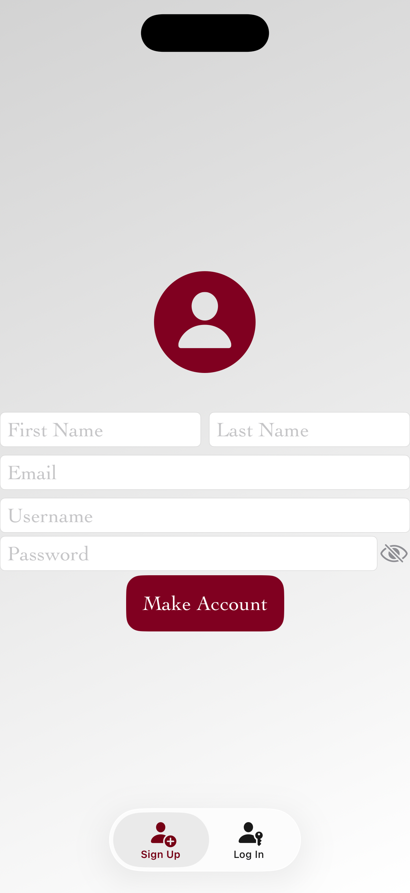

# iOS Wine Collection Tracking Application

## Features
* Designed UI using SwiftUI
* Provided on-device persistence with CoreData
* Leveraged caching to speed up large queries
* Used OOP principles to represent accounts and wines with an aggregate relationship
* Wrote a quicksort implementation to sort and filter wines based on object attributes
* Created account authentication page

## Application Screenshots

